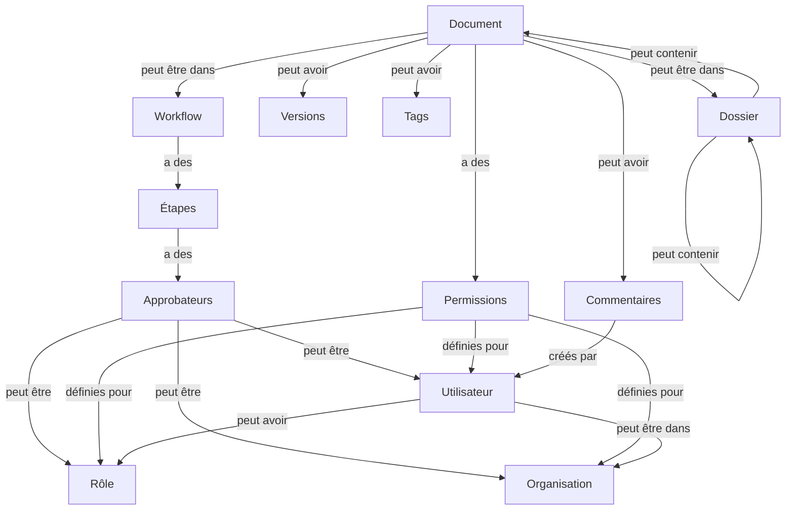

# Architecture du système ESAG GED

Ce document présente l'architecture technique du système de gestion électronique de documents et de workflow ESAG GED.

## Vue d'ensemble

ESAG GED est une application web moderne basée sur une architecture client-serveur:

- **Frontend**: Application React en TypeScript avec Chakra UI
- **Backend**: API RESTful développée en Python avec Flask
- **Base de données**: PostgreSQL pour le stockage relationnel des données
- **Stockage de fichiers**: Système de fichiers local ou Cloudinary (configurable)

## Diagramme du modèle de données

Le système s'articule autour des entités principales suivantes:



## Architecture du backend

### Structure des dossiers

```
AppFlask/
├── api/                 # API REST
│   ├── auth.py          # Authentification
│   ├── document.py      # Gestion des documents
│   └── ...
├── models/              # Modèles de données
│   ├── workflow.py      # Modèle de workflow
│   ├── history.py       # Modèle d'historique
│   └── ...
├── routes/              # Routes web (interface utilisateur)
│   ├── auth_routes.py   # Routes d'authentification
│   ├── document_routes.py # Routes de documents
│   └── ...
├── sql/                 # Scripts SQL
│   ├── create_workflow_tables.sql  # Création des tables de workflow
│   └── ...
├── static/              # Fichiers statiques
├── templates/           # Templates HTML
├── utils/               # Utilitaires
├── __init__.py          # Initialisation de l'application
├── app.py               # Point d'entrée principal
└── db.py                # Connexion à la base de données
```

### Composants principaux

1. **API RESTful**

   - Endpoints organisés par domaine fonctionnel
   - Authentification par JWT (JSON Web Tokens)
   - Validation des entrées et gestion des erreurs

2. **Modèles de données**

   - Abstraction pour l'accès à la base de données
   - Logique métier encapsulée
   - Pas d'ORM, utilisation directe de psycopg2 avec SQL

3. **Système de routage**

   - Organisation par fonctionnalité (Blueprints Flask)
   - Séparation des responsabilités

4. **Gestion des fichiers**

   - Support du stockage local
   - Intégration avec Cloudinary pour le stockage cloud
   - Génération de noms uniques pour éviter les collisions

5. **Système d'historique**
   - Traçabilité des actions
   - Journalisation détaillée
   - Facilite l'audit et la conformité

## Architecture du frontend

### Structure des dossiers

```
frontend/
├── public/              # Fichiers statiques publics
├── src/                 # Code source
│   ├── components/      # Composants React
│   │   ├── Document.tsx # Gestion des documents
│   │   ├── Workflow.tsx # Gestion des workflows
│   │   └── ...
│   ├── services/        # Services d'API
│   ├── App.tsx          # Composant principal
│   ├── index.tsx        # Point d'entrée
│   └── config.ts        # Configuration
├── package.json         # Dépendances
└── tsconfig.json        # Configuration TypeScript
```

### Composants principaux

1. **Interface utilisateur**

   - Composants React modulaires
   - Chakra UI pour le design system
   - Interface responsive adaptée aux mobiles et ordinateurs

2. **Gestion d'état**

   - État local avec les hooks React (useState, useEffect)
   - Context API pour l'état global limité

3. **Communication avec le backend**

   - Services API avec axios
   - Gestion des erreurs et des états de chargement
   - Intercepteurs pour la gestion des tokens JWT

4. **Routing**
   - React Router pour la navigation
   - Protection des routes authentifiées

## Base de données

### Schéma simplifié

- **utilisateur**: Gestion des utilisateurs et authentification
- **role**: Définition des rôles système
- **utilisateur_role**: Association entre utilisateurs et rôles
- **document**: Métadonnées des documents
- **document_version**: Versions de documents
- **dossier**: Structure hiérarchique
- **tag**: Classification des documents
- **document_tag**: Association entre documents et tags
- **workflow**: Définition des workflows
- **workflow_etape**: Étapes de workflow
- **workflow_approbateur**: Approbateurs pour chaque étape
- **workflow_instance**: Instances de workflow en cours
- **workflow_approbation**: Décisions d'approbation
- **workflow_notification**: Notifications système
- **organisation**: Groupes d'utilisateurs
- **membre**: Membres des organisations
- **history**: Journal d'activité
- **corbeille**: Éléments supprimés

### Optimisations

- Indices sur les colonnes fréquemment utilisées pour la recherche
- Contraintes d'intégrité référentielle
- Transactions pour garantir la cohérence des données
- Types JSON/JSONB pour les données semi-structurées

## Sécurité

1. **Authentification**

   - Système basé sur JWT
   - Stockage sécurisé des mots de passe (hachage)
   - Limitation des tentatives de connexion

2. **Autorisation**

   - Contrôle d'accès basé sur les rôles (RBAC)
   - Permissions granulaires au niveau des documents
   - Vérification des permissions à chaque opération

3. **Protection des données**

   - Validation des entrées
   - Protection contre les injections SQL
   - CORS configuré pour limiter les origines

4. **Audit**
   - Journal complet des actions
   - Traçabilité des modifications

## Flux de travail typiques

### Création et approbation d'un document

1. Un utilisateur crée un document et le téléverse
2. Il démarre un workflow pour ce document
3. Les approbateurs reçoivent des notifications
4. Ils consultent le document et approuvent/rejettent
5. Le document passe d'une étape à l'autre
6. À la fin du workflow, le document est marqué comme approuvé

### Recherche et consultation de documents

1. Un utilisateur utilise la recherche ou navigue dans l'arborescence
2. Le système vérifie les permissions sur chaque document
3. Seuls les documents autorisés sont affichés
4. L'utilisateur peut prévisualiser ou télécharger selon ses droits

## Extensibilité

Le système a été conçu pour être facilement extensible:

1. **Ajout de fonctionnalités**

   - Structure modulaire (Blueprints Flask, composants React)
   - Séparation claire des responsabilités

2. **Intégrations externes**

   - API RESTful documentée
   - Hooks pour les extensions

3. **Personnalisation**
   - Métadonnées personnalisables
   - Workflows configurables

## Performances et mise à l'échelle

1. **Optimisations de base de données**

   - Indices appropriés
   - Pagination des résultats

2. **Mise en cache**

   - Cache de session pour les données fréquemment utilisées
   - Cache d'authentification

3. **Options de mise à l'échelle**
   - Base de données PostgreSQL réplicable
   - Possibilité de déployer derrière un équilibreur de charge

## Limites connues et améliorations futures

1. **Indexation de contenu**

   - Ajout d'un moteur de recherche plein texte (Elasticsearch)

2. **Amélioration de l'expérience mobile**

   - Application mobile native ou PWA

3. **Intégrations supplémentaires**

   - Connecteurs pour Office 365, Google Workspace
   - Signature électronique

4. **Performances**
   - Optimisation pour les grands volumes de documents
   - Système de mise en cache plus sophistiqué
